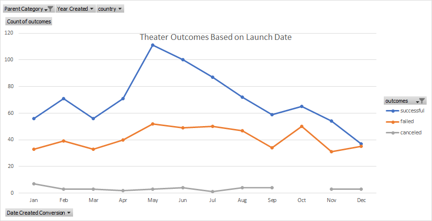
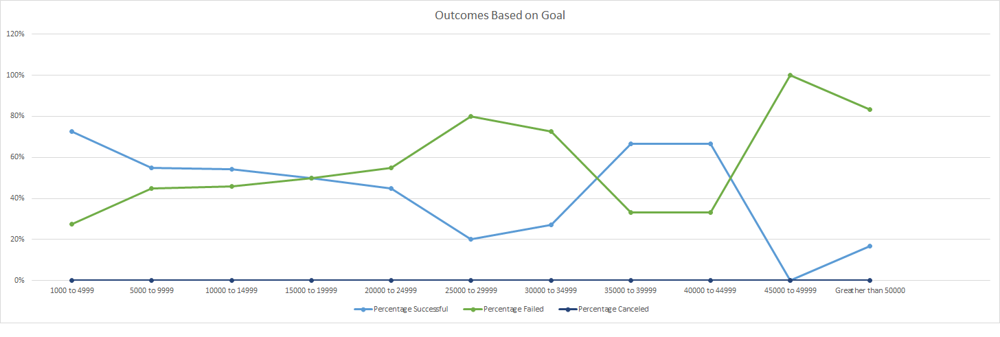

## Performing analysis on Kickstarter data to uncover trends in Campaigns

### Purpose
Due to Lousie's play _Fever goal_ being reached in  a short amount of time, with the data set(xlsx) Louise would like to know how different campaigns fared in relation to their launch date and their funding goal. The dataset was already scrubbed within following the modules but in order to analyze different campaigns we will be utilizing the visualizations prowess and pivot tables within Excel.  

## Analysis and Challenges

### Analysis of Outcomes Based on Launch Date

In my first deliverable, I wanted to look at campaign outcomes based on the launch dates. The outcomes that were being analyzed were "successful", "failed" and "canceled" and filtered to only show the Parent Category "theater". The best tool for this analysis is using pivot tables. While I could have just inserted a basic table off the data set and filtered the data it was would have added unnecessary steps. Using a pivot table was the best option. 

The pivot table I created based off the outcomes and parent category, stated before, gave a table with numbers bases off the months of a year. While it is useful table with numbers and it doesn't help because it doesn’t tell you what is actually going on. Creating line chart with markers helps to visualize the data set. From the visualization, the outcomes in started of the year with high numbers. While the successful had higher numbers, which does not come at a surprise, the year just started and projects are hitting the ground running. Campaigns heading into March start to decrease and we hit our first  minimum of our data. Then the campaigns after hitting a low start increasing through May and there we hit our absolute maximum. From May until Sep we start seeing the projects decrease overall. The maximum 166 decreases to 97 in Sep. While see campaigns start to launch up in Oct, there was actually 0 canceled in Oct. Lastly, to finish the year campaigns are less successful where as the failed campaigns almost matches the successful.

In May we can see it was a good month for projects out of the total 166 projects 111 were successful! 

### Analysis of Outcomes Based on Goals

In the second deliverable, we are dealing more with formulas to see the numbers on outcomes based of goal. 

At first glance the outcomes based of the goal of less then $1,000 were the most successful. 

A surprisingly successful was the goal from $35,00 - $39,999 because as seen in the line chart after a goal of $1,000 the percentage of successful outcomes was decreasing. So based of this line chart if I wanted my campaign to be successful I would start with goal of less then $1,000.

### Challenges and Difficulties Encountered

My only challenge with this data set was the that the timestamps column I and J were in Unix format, something i never seen before. 

I actually had got the year before the module stated to do so. I knew that with only dates in format dd/mm/yyyy, our data would have been to broad to visualize and also the pivot table would have been to big to get any insight from it. 

Another challenge is more of writing the analysis. For me it is knowing the difference from summarizing everything and actually analyzing the visuals. 

The counifs at first I didn’t realize the lower and upper limit were inclusive, so i actually had to go an research if less/ greater then equal is an operator in the count if formula. 

## Results

- What are two conclusions you can draw about the Outcomes based on Launch Date?
  - I know we had only filtered on certain categories, so based off the category in our first deliverable I would recommend launching from May through September. While October had more successful outcomes than failed, the number of failed was too close to comfort with successful outcomes.
- What can you conclude about the Outcomes based on Goals?
  - The lower our goal amount the more successful the outcome. If I wanted to gamble on a higher amount the goal of 35000-44999 had above %50 success rate. Overall a goal of 0-4999, had the best success rate. 
- What are some limitations of this dataset?
  - One limitation is the countries. The more countries we add to this data set the larger the insight of campaigns. With the limited countries this is only a small sample size.
  - Perhaps having the number of people working on the project could have helped justify the outcomes.
  -  Dates, the only dates we have are the launch date and deadline.
- What are some other possible tables and/or graphs that we could create?
  - We could create tables of each parent category and have subcategories as the rows to see which were the most successful in each parent category. 
  - With this data we can perhaps predict an outcome, i.e. linear regression, decision tree.
